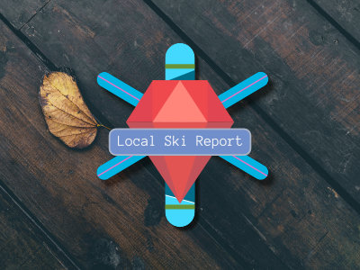

# Ski Report CLI Gem

This Ruby Gem provides a Command-Line Interface (CLI) for retrieving the most recent ski report from onthesnow.org. With this gem, users can easily find ski areas and resorts by selecting a region, state, and specific resort. The gem then fetches and displays the corresponding ski report for the chosen resort.

# Features

- Retrieve up-to-date ski reports from **onthesnow.org**
- Search for ski areas by region and state.
- Selet a specific resort to view its ski report.
- Easy-to-use CLI for seamless navigation.
- Nicely formatted information thanks to utilizing `terminal-tables` gem.

## Installation

To install the LocalSkiReport Gem, follow these steps:

1.Clone the repository: git clone https://github.com/your-username/local-ski-report-gem.git

2. Change into the project directory: `cd local-ski-report-gem`

3. Install the necessary dependencies: `bin/setup`

4. Run spec: `rake spec`

5. Run the application: `ruby bin/local-ski-report`

6. Interactive session: `bin/console`

## Usage

After starting the Ski Report CLI Gem, follow the prompts to search for ski areas and resorts. Use the provided options to navigate through the available regions, states, and resorts. Once you've selected a resort, the gem will display the most recent ski report for that specific location.

# Future Improvements

- Expand this gem to include Regions outside of the USA
- Add Additional columns to report to expand upon information.

## ChangeLog

The recent update of the LocalSkiReport Gem includes the following enhancements:

- Complete rewrite: The application has been restructured to follow best practices and improve code organization.

- Introduction of RSPEC testing: The gem now incorporates RSPEC tests to verify the functionality and reliability of the application.

- Fixing the Scraper class: The Scraper class has been fixed to address issues caused by the recent update of onthesnow.org to React.js. The scraper can now successfully retrieve data from the website.

### Version 0.1.5

Is a full rewrite of the LocalSkiReport GEM into a better structured application with RSPEC supported testing.

Fixing application breaking Scraper class that no longer was able to retrieve data from onthesnow.org due to the site updating the front end to React.js.

## Contributing

Bug reports and pull requests are welcome on GitHub at https://github.com/Nick-Damico/local-ski-report-cli-gem. This project is intended to be a safe, welcoming space for collaboration, and contributors are expected to adhere to the [Contributor Covenant](http://contributor-covenant.org) code of conduct.

## License

The gem is available as open source under the terms of the [MIT License](http://opensource.org/licenses/MIT).
